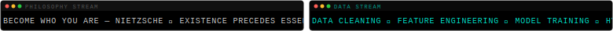
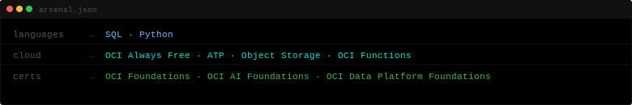

  

  

<table>
  <tr>
    <td width="35%" align="center">
      
    </td>
    <td width="65%" valign="top" align="left">
      <h3>Profissional de dados em formação — análise, ciência e engenharia.</h3>
      

        Construindo expertise prática em análise e ciência de dados, trabalhando com Python, SQL e Oracle Cloud Infrastructure. Cursando Análise e Ciência de Dados enquanto desenvolvo projetos end-to-end — da ingestão de dados brutos até modelagem preditiva.
      

      

        Focado em transformar dados em decisões que geram valor para o negócio..
      

    </td>
  </tr>
</table>

  

## `▸ Arsenal`

  

---

*"Live as if every moment would return eternally."*

*— Nietzsche · Eternal Recurrence*

---

<table>
  <tr>
    <td valign="top" width="65%">
      <h3>▸ Active Missions</h3>

| Project | Status | Stack |
|---|---|---|
| **Análise de Risco de Crédito Oracle** | 🟢 in progress | Python · LightGBM · OCI · SQL |
| **Analyst Quest** | 🟡 in development | Flutter Web · CRISP-DM |

  </td>
    <td valign="top" width="35%" align="center">
      
    </td>
  </tr>
</table>

## `▸ Metrics`

&nbsp;

  

---

*"If a daemon told you to run your life again forever...*
*would you press* `ENTER`*?"*

*— Nietzsche · The Daemon*

 

